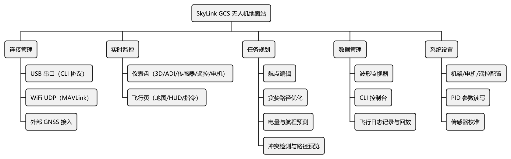
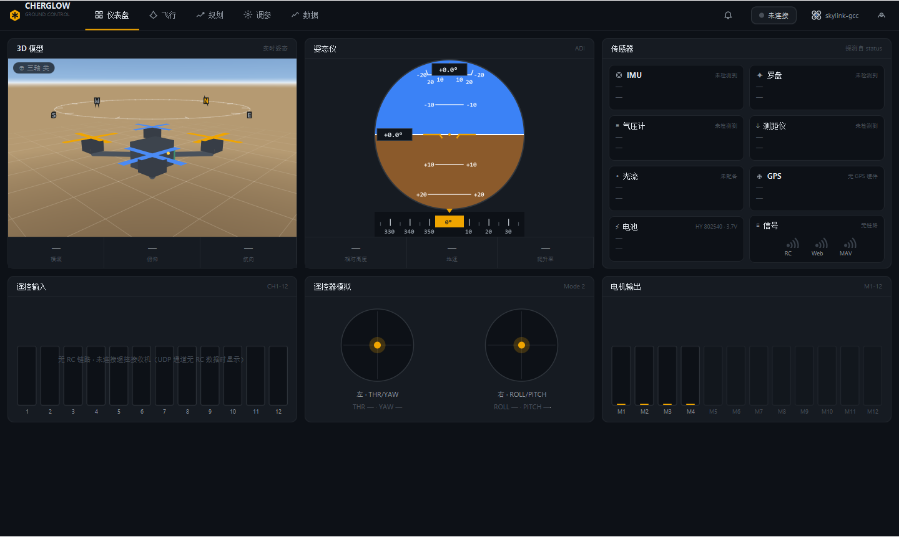
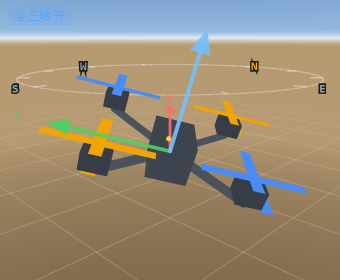
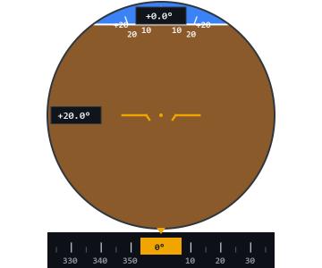
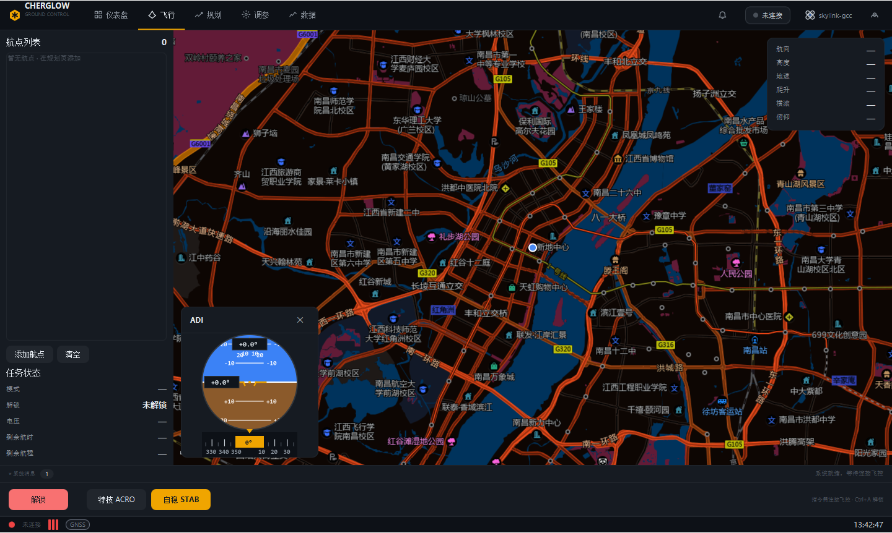
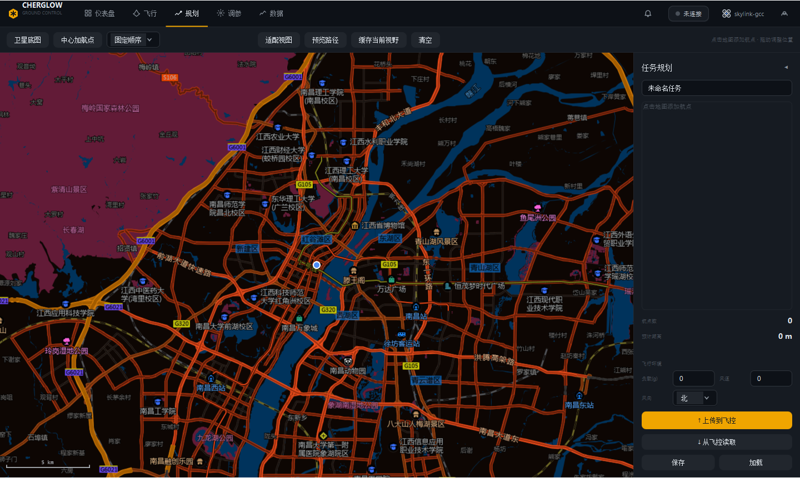
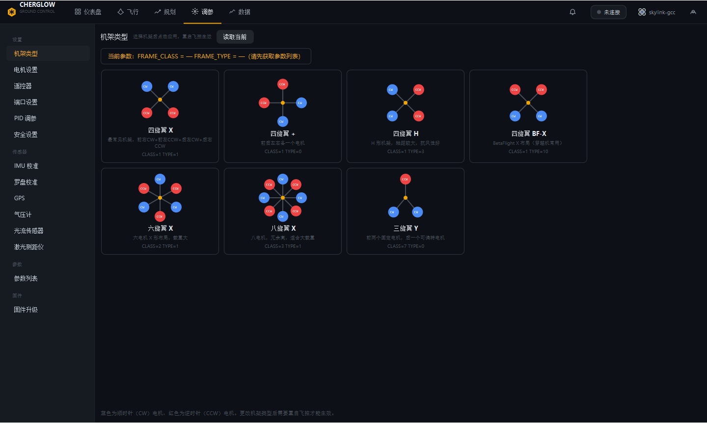
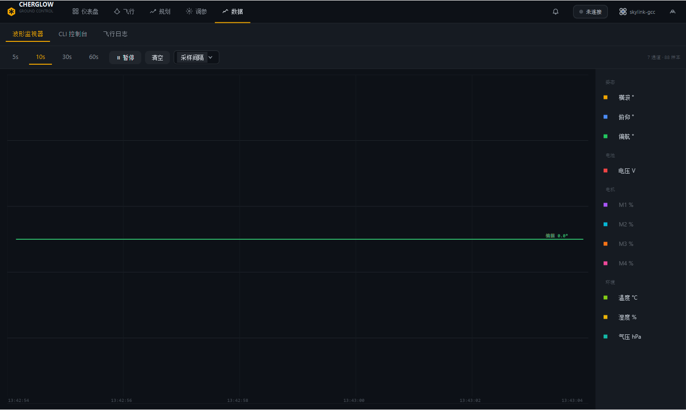

# SkyLink GCS · CHERGLOW 地面站复刻

> ⚠️ **本项目为大学生课程设计最终代码仓库，仅作学术公开用途，不再进行后续维护。**

JavaFX 桌面无人机地面站（GCS）课程实践作品，致敬并复刻 [CHERGLOW GCS](https://gc.cherglowtech.com/) 的界面与交互体验，适配 [琛光（Songge8）E1](https://github.com/songge8/CF-Drone) 系自研机的 CLI 文本协议及 WiFi 接入点 MAVLink UDP 高频遥测，实现连接、遥测、仪表、飞行指令、任务规划、调参、波形监视、CLI 控制台与飞行日志全链路。

> 全部显示数据来自真机，**不使用任何模拟器/假数据**；「遥控器模拟」面板的杆位由电机实际输出反向推演。

## 致谢

- 🛩️ **[琛光 E1 / CF-Drone](https://github.com/songge8/CF-Drone)**：感谢琛光团队开源自研飞控固件（ESP32 + `quaternion.h`/`imu.ino`），为本项目提供了可靠的硬件平台与完整的 CLI 通信协议栈。没有你们的努力，不会有本项目的起点。
- ✈️ **[CHERGLOW GCS](https://gc.cherglowtech.com/)**：感谢 CHERGLOW 团队设计的优秀地面站界面与功能规范，是本项目复刻的主要灵感来源。其 UI 理念贯穿了本项目的每个页面。

---

## 目录

1. [项目概述](#1-项目概述)
2. [核心功能](#2-核心功能)
3. [系统架构](#3-系统架构)
4. [安装说明](#4-安装说明)
5. [使用指南](#5-使用指南)
6. [开发文档](#6-开发文档)
7. [贡献指南](#7-贡献指南)

---

## 1. 项目概述

SkyLink GCS 是一个 JavaFX 桌面无人机地面站应用，面向科研教学与小规模自主飞行项目，提供完整的无人机实时监控与控制能力。

### 三通道通信能力

| 通道 | 协议 | 场景 |
|---|---|---|
| **USB 串口**（主通道） | CLI 文本协议 @ 115200 8N1 | ESP32 直连，完整参数读写、模式切换、解锁控制 |
| **WiFi / UDP**（S13） | MAVLink v1/v2 @ 14550 | 接入无人机 AP「Drone_WiFi」后的高频遥测 + COMMAND_LONG 解锁 + PARAM 协议桥接 CLI |
| **外部 GNSS HTTP**（S14） | GPSLogger Custom URL → :8080 | 手机连同一 AP 作为外部 GNSS 载荷，地图/航迹/航程预测使用真实 GPS 坐标 |

### 技术栈

| 组件 | 版本 |
|---|---|
| Java | 17（Temurin） |
| JavaFX | 17.0.2（controls / graphics / base / web，win classifier） |
| jSerialComm | 2.11.0 |
| JUnit Jupiter | 5.10.2 |
| javafx-maven-plugin | 0.0.8 |
| Maven | ≥ 3.8（本机使用 `~/.m2/wrapper/dists/apache-maven-3.9.6-bin/.../bin/mvn.cmd`） |

### 设计原则

- **真机数据**——所有显示数据必须来自真机，禁止硬编码或模拟数据。
- **离线地图**——高德矢量瓦片缓存于本地，不依赖在线服务。
- **全中文 UI**——界面、UI 提示、报告文档均使用中文。
- Canvas 自绘引擎——地图、ADI、波形等均通过 Canvas 绘制，性能优于 WebView。



---

## 2. 核心功能

应用分为六个页面区域（顶栏导航 + 侧栏 Tab + 主内容区），每个页面覆盖独立功能域：

### 仪表盘页

综合状态看板，实时显示 3D 四旋翼模型（分色地平线 + 罗盘环 + 地面网格 + 三轴箭头参考系）、ADI 姿态仪、传感器在线状态、遥控输入、遥控器模拟（电机反推）、电机输出等。



- **3D 姿态模型**：Canvas 软投影渲染 FLU 机体系四旋翼，对齐 CF-Drone 固件姿态口径（+roll=右倾、+pitch=低头、+yaw=左转）。



- **ADI 姿态仪**：地平线平移 + 俯仰梯度条，−pitch 口径，支持四帧 PNG 快照导出。



### 飞行页

全幅离线地图 + HUD（航向/横滚/俯仰等）、迷你 ADI 浮窗、系统消息条、指令条（解锁/上锁二次确认 + ACRO/STAB 直切）、任务横幅。



### 规划页

任务面板（航点增删/距离统计/保存加载 JSON）、地图点击加航点；内置贪婪最近邻 O(n²) 路线规划 + 电池电量预测（五特征最小二乘回归）。



### 调参页

参数字典驱动的机架/电机/遥控器/端口/PID/安全/传感器分组，参数读写回读校验，校准向导（ca/cr/cm）。约 90 项参数字典，三态显示（正常/待写/未读）。



### 数据页

三 Tab：**波形监视器**（16 通道采样 + 时间窗 + 十字光标）、**CLI 控制台**（危险指令二次确认/过滤/暂停/自动滚动）、**飞行日志**（解锁自动记录/回放 8 曲线）。



### 能力亮点

- **纯 Canvas 自绘离线地图**：LRU512 缓存 + 磁盘直读 + 高德异步补块落盘 + 上级瓦片补位 ≤3 级，运行时像素反相做暗色化。
- **16 通道波形监视器**：250ms 采样间隔，环形缓冲，十字光标读数。
- **航线规划域**：贪婪最近邻算法 O(n²)、最小二乘电量/航程预测（BatteryPredictor + LinearRegression）。
- **不可变遥测快照**：VehicleSnapshot Builder 模式跨线程传递，NaN 不覆盖历史值。

> 完整界面截图可见上述各小节插图。

---

## 3. 系统架构

### 分层结构

```
┌─────────────────────────────────────────────────────┐
│                    ui/         (界面层)              │
│   MainShell / TopNav / BasePage(模板方法) /         │
│   5个Page / 6个Widget / 2个Dialog / MapView         │
├─────────────────────────────────────────────────────┤
│               core/           (业务编排层)           │
│   ConnectionService(单例) / CliLink / MavLinkLink /  │
│   AppState / FlightRecorder(单例) /                  │
│   CommandLink(接口) / BatteryPredictor /             │
│   RoutePlanner / MissionXml / RangeEstimator         │
├─────────────────────────────────────────────────────┤
│               model/          (实体层)               │
│   LiveVehicle(43只读属性三分组) /                     │
│   VehicleSnapshot+Builder / Waypoint                │
├─────────────────────────────────────────────────────┤
│     protocol/cli/ protocol/mavlink/  (协议层)        │
│   CliProtocol(40正则解析) / MavLink(v1+v2编解码)     │
├─────────────────────────────────────────────────────┤
│       serial/  transport/    (传输层)                │
│   SerialTransport(jSerialComm封装)                   │
│   UdpTransport(MAVLink UDP绑定14550)                 │
│   GpsHttpServer(GPSLogger HTTP代理:8080)             │
├─────────────────────────────────────────────────────┤
│      map/  util/  tools/        (工具层)            │
│   TileServer(内嵌HTTP服务器:8135)/                    │
│   Browse / FxSafe / GeoConvert                       │
│   TileDownloader / SerialSmokeTest /                  │
│   S12E2eCheck / View3DNapshot / AdiSnapshot           │
└─────────────────────────────────────────────────────┘
```

### 包结构

```
src/main/java/com/cherglow/gcs/
├── App.java                        入口；ThemeManager.setMainScene/apply
├── Launcher.java                   launch-gcs.bat 用的 main
├── core/
│   ├── AppState.java               connStatus{DISCONNECTED/CONNECTING/CONNECTED/ERROR}
│   ├── ConnectionService.java      单例；桥接 CliLink→AppState/LiveVehicle
│   ├── CliLink.java                轮询计划；PendingCmd 队列
│   ├── MavLinkLink.java            MAVLink/UDP 链路（遥测 FRD→FLU）
│   ├── CommandLink.java            串口/UDP 通道抽象接口
│   ├── ConnectionManager.java      多通道管理
│   ├── FlightRecorder.java         单例；250ms Timeline 采样 → skylog 文件
│   ├── BatteryPredictor.java       五特征最小二乘电量预测
│   ├── LinearRegression.java       最小二乘 β=(XᵀX)⁻¹Xᵀy
│   ├── RoutePlanner.java           贪婪最近邻 O(n²) 航线规划
│   ├── RangeEstimator.java         信号范围估算
│   └── MissionXml.java             任务 XML 存取（四重校验 + XXE 加固）
├── model/
│   ├── LiveVehicle.java            43 只读属性（姿态/电池/传感器三分组）
│   ├── VehicleSnapshot.java        不可变快照（Builder 模式）
│   └── Waypoint.java              航点定义 + 角色枚举
├── protocol/
│   ├── cli/CliProtocol.java        40 正则解析 CLI 文本协议
│   └── mavlink/MavLink.java        v1/v2 编解码（CRC_EXTRA 字节累加）
├── serial/SerialTransport.java     jSerialComm 封装；open 前 clearDTR()/clearRTS()
├── transport/
│   ├── UdpTransport.java           MAVLink UDP（绑 14550、首包锁源、10054 容错）
│   └── GpsHttpServer.java          外部 GNSS HTTP 端点（:8080）
├── map/TileServer.java             高德瓦片缓存代理（:8135）
├── ui/
│   ├── MainShell.java              主窗口壳
│   ├── TopNav.java                 顶栏 Tab 导航
│   ├── ThemeManager.java           looked-up color 换肤
│   ├── widget/
│   │   ├── Drone3DView.java        3D 四旋翼 Canvas 自绘
│   │   ├── AdiWidget.java          ADI 姿态仪
│   │   ├── JoystickWidget.java     遥控器摇杆交互
│   │   ├── SensorCard.java         传感器在线状态卡片
│   │   ├── SignalCard.java         WiFi 信号强度可视化
│   │   └── WifiLinkIcon.java       WiFi 连接图标
│   ├── dialog/
│   │   ├── ConnectDialog.java      连接对话框（串口/UDP/GNSS 三通道）
│   │   └── PredictDialog.java      电池预测结果展示
│   ├── map/MapView.java            纯 Canvas 瓦片引擎
│   ├── pages/
│   │   ├── BasePage.java           模板方法基类
│   │   ├── OverviewPage.java       仪表盘页
│   │   ├── FlyPage.java            飞行页（HUD+模式+指令）
│   │   ├── PlanPage.java           任务规划页
│   │   ├── SetupPage.java          调参页
│   │   └── DataPage.java           波形/控制台/日志三 tab
│   └── setup/ParamDict.java        参数中文名/范围字典 ~90 项
├── util/
│   ├── Browse.java                 浏览器启动辅助
│   ├── FxSafe.java                 JavaFX 线程安全辅助
│   └── GeoConvert.java             GCJ-02 纠偏 + WGS84 转换
└── tools/                          开发辅助工具（java 直跑，不进主程序）
    ├── TileDownloader.java         批量下载瓦片扩区
    ├── SerialSmokeTest.java        串口链路 5s 冒烟
    ├── RawSerialProbe.java         串口协议探针
    ├── View3DSnapshot.java         3D 模型 PNG 快照（9 帧）
    ├── AdiSnapshot.java            ADI 姿态仪 PNG 快照（4 帧）
    ├── S12E2eCheck.java            真机端到端自检
    └── UiSnapshot.java             UI 截图导出
```

### 关键设计机制

| 机制 | 说明 |
|---|---|
| **CommandLink 接口** | CliLink（串口 CLI）与 MavLinkLink（UDP MAVLink）实现统一 `CommandLink` 接口，`ConnectionService` 持有引用并通过多态调用，新增通道只需实现该接口。 |
| **VehicleSnapshot 不可变快照** | 构建者模式创建不可变对象，跨线程安全传递；采集侧 250ms 轮询、回放侧读取——NaN 不覆盖已有历史值。 |
| **BasePage 模板方法** | 六页面继承 `BasePage`，共享 initUI/onConnect/onDisconnect 生命周期钩子，子类覆写具体实现，TopNav 按 Tab 索引分发。 |
| **FlightRecorder 单例** | 解锁时 `armed=true` 自动开始记录，上锁或断开自动结束并保存到 `~/.skylink/logs/session_<ts>.skylog`。 |
| **Canvas 自绘地图** | LRU512 瓦片缓存 + 磁盘直读 + TileServer 在线补块渐进落盘，**勿回退 WebView 方案**。 |

### 类图套件

本仓库维护一套 7 张 UML 类图 SVG 矢量文件，涵盖从全景概览到各域细节的教学级标注：

| 类图 | 内容 |
|---|---|
| [概要类图](<docs/uml/SkyLink GCS 概要类图.svg>) | 全部 55 个运行类分层全景（界面 24 / 业务编排 11 / 实体 4 / 协议 2 / 传输 4 / 工具 3 / 开发辅助 7），主干关系 + 全景走读 |
| [旧版类图](<docs/uml/SkyLink GCS 类图.svg>) | 2026-09-07 旧版教学口径（标注：全部属性 private、仅 public 方法、斜体=接口、四种关系标注），配套 `.agent/uml-src/class-diagram.puml` |
| [详细图1 - 连接管理链路](<docs/uml/SkyLink GCS 详细图1-连接管理链路.svg>) | ConnectionService / ConnectionManager / CommandLink / LinkChannel / CliLink / MavLinkLink / SerialTransport / UdpTransport — ★多态调用点、状态机语义（首包转连/3s 看门狗/指数退避）、解锁指令走读 |
| [详细图2 - 遥测模型与飞行记录](<docs/uml/SkyLink GCS 详细图2-遥测模型与飞行记录.svg>) | LiveVehicle(43 只读属性三分组) / VehicleSnapshot+Builder / AppState / FlightRecorder / Session — 写侧收口、不可变快照跨线程、NaN 不覆盖、.skylog 文件注记 |
| [详细图3 - 任务规划与预测域](<docs/uml/SkyLink GCS 详细图3-任务规划与预测域.svg>) | RoutePlanner+RouteResult / MissionXml+MissionFile / BatteryPredictor+PredictionResult / LinearRegression / RangeEstimator / Waypoint — 贪婪最近邻 O(n²)、最小二乘 β=(XᵀX)⁻¹Xᵀy、XML 四重校验+XXE 加固、五特征物理系数 |
| [详细图4 - 协议层](<docs/uml/SkyLink GCS 详细图4-协议层.svg>) | CliProtocol(40 正则) / MavLink(MSG 常量/CRC_EXTRA/学习)+Parser/PBuf/Frame — v1/v2 双协议状态机、CRC_EXTRA 字节累加、黄金帧/黄金样本双护栏 |
| [详细图5 - UI 体系](<docs/uml/SkyLink GCS 详细图5-UI体系.svg>) | MainShell / BasePage / 五页面 / TopNav / MapView / widget 群 / ThemeManager/Toast/ConfirmDialog/Icons — 模板方法+多态分发、Canvas 自绘（软投影/姿态仪/瓦片引擎/波形）、looked-up color 换肤 |

类图生成脚本位于 `.agent/uml-src/`（本地开发目录，未随仓库分发），修改后重跑 svggen.py + 各图 gen 脚本即可再生成；SVG → PNG 可用 Edge 无头渲染：

```bash
msedge --headless --screenshot=out.png --window-size=W,H file:///路径.svg
```

---

## 4. 安装说明

### 环境要求

| 项 | 要求 |
|---|---|
| 操作系统 | Windows |
| JDK | 17（Temurin） |
| Maven | ≥ 3.8（如不在 PATH，本机完整路径为 `C:/Users/wjh22/.m2/wrapper/dists/apache-maven-3.9.6-bin/.../bin/mvn.cmd`） |
| JavaFX | 项目中已通过 maven-bundle-plugin 引入 17.0.2 win classifier 构件 |

### 从源码编译运行

```bash
# 进入项目根目录（注意两层嵌套）
cd skylink-gcs-main

# 编译 + 单元测试（CLI 协议解析黄金样本 + 连接状态机矩阵 + MAVLink 14 项黄金帧）
mvn test

# 启动应用
mvn javafx:run
```

### 一键启动（已编译产物）

```powershell
# Windows 快捷方式（launch-gcs.vbs → launch-gcs.bat）
# 内置增量编译，热启动约 3 秒
launch-gcs.vbs   # 或桌面「SkyLink GCS」快捷方式
```

### 打包为 Windows 安装包

```powershell
powershell -ExecutionPolicy Bypass -File package-jpackage.ps1
# 产物：target/installer/SkyLinkGCS-1.0.0.exe
# 若系统未安装 WiX 3.x 则自动回退目录版：target/installer/SkyLinkGCS/
```

### 防火墙放行提示

首次启动时可能需要放行以下端口的入站规则：

| 端口 | 服务 | 说明 |
|---|---|---|
| 8080 | GpsHttpServer | 外部 GNSS HTTP 端点 |
| 8135 | TileServer | 瓦片缓存代理 |
| 14550 | UdpTransport | MAVLink UDP 接收 |

---

## 5. 使用指南

### 真机连接

| 项 | 值 |
|---|---|
| 端口 | USB 虚拟串口（本机为 **COM5**），**115200 8N1** |
| DTR/RTS | 打开串口前 **DTR/RTS 必须为 false**，否则 ESP32 复位重启（驱动已内置处理） |
| 供电 | USB 供电时 `status` 读数约 3.31V，**低于解锁阈值属正常**（未插电池）；插上 1S 锂电后才能解锁 |
| 传感器 | 实机无 GPS/磁力计/气压计/激光测距/光流，对应卡片显示空态「—」为正确表现 |

连接入口：顶栏「连接」→ 选通道 → 连接；连接失败（如端口被占用）保持错误态并自动退避重试。

#### 通道一：串口 / USB（主通道）

COM5 @ 115200 8N1，CLI 文本协议轮询（`ConnectionService` 持有 `CliLink` 引用）。

#### 通道二：UDP / WiFi（S13 — MAVLink）

电脑加入无人机 AP「Drone_WiFi」（默认密码 12345678）后，填 192.168.4.1:14550 直连 MAVLink——高频遥测 + 解锁/模式/调参全功能（COMMAND_LONG / PARAM 协议 / SERIAL_CONTROL 桥接 CLI）。本机占用 UDP 14550 端口。

#### 通道三：外部 GNSS HTTP（S14）

手机装 GPSLogger（GPS 记录器）连同一 AP，Custom URL 填 `http://<电脑WLAN_IP>:8080/gps?lat=%LAT&lon=%LON&alt=%ALT&spd=%SPD`（间隔 1s，速度单位 m/s）→ GCS 地图/航迹/航程预测使用手机真实 GPS。首次启动若防火墙弹窗请允许 8080 入站；手机浏览器访问 `http://<电脑WLAN_IP>:8080/` 可见「GNSS link OK · received fixes: N」自检页。

### 页面操作要点

| 页面 | 操作要点 |
|---|---|
| 仪表盘 | 观察 3D 模型方向对照机身姿态；ADI 俯仰符号对齐固件（+pitch=低头）；传感器卡片区区分缺失型与正常上报。 |
| 飞行 | 命令栏解锁需二次确认（`arm` 类指令强制弹出 ConfirmDialog）；模式切换直切 ACRO/STAB；ADHOLD/POSHOLD 在 UI 中原样显示 RAW 值。 |
| 规划 | 地图点击添加航点，右侧任务面板可编辑 altitude/yaw；haversine 距离统计；JSON 存 `~/.skylink/missions/`。 |
| 调参 | 参数字典 ~90 项分组显示；写入后回读校验差异 Toast 提示；校准向导 ca/cr/cm 三步式。 |
| 数据 | 波形 16 通道自由组合 + 时间窗缩放 + 十字光标读数；控制台危险命令二次确认 + 关键字过滤；飞行日志 8 曲线回放 + 滑块。 |

### CLI 协议速查（只读）

| 命令 | 返回值 |
|---|---|
| `status` | 状态+电池+安全 |
| `ps` | roll/pitch/yaw（ZYX 欧拉角，度） |
| `psq` | 四元数（q0/q1/q2/q3） |
| `rc` | 通道值+控制量 |
| `mot` | 电机 0~3 输出百分比 |
| `imu` | 陀螺/加计 |
| `p` | 全量参数（约 100 项，"NAME = value" 行格式） |
| `p NAME` | 单参数读取 |
| `p NAME value` | 参数写入 |
| `sys` | 系统信息 |
| `wifi` | WiFi 状态 |

模式映射：RAW(0) / ACRO(1) / STAB(2)。

危险命令（UI 强制二次确认）：`arm` `mfr` `mfl` `mrr` `mrl` `preset` `reboot`

### 姿态口径（与固件 CF-Drone 对齐）

机体系 **FLU：X 机头、Y 左、Z 上**；`ps` 输出为 ZYX 欧拉角（度）：**+roll=右倾、+pitch=低头、+yaw=左转（逆时针）**。无磁力计 → yaw 为上电起陀螺积分的**相对航向**（`reset` 清零），界面罗盘环的「N」代表上电时机头方向，非地理北。

> ⚠️ 修改姿态显示代码前先读固件 `quaternion.h`/`imu.ino`，勿凭直觉定符号。

### 离线地图

- 瓦片缓存 `~/.skylink/tiles/`（约 316MB：全国 z3-8 + 北京 20km z11-15 + 南昌 25km z10-15，高德矢量/卫星双底图，矢量瓦片运行时像素反相做暗色）。
- 运行时在线补块由内置 `TileServer`（0.0.0.0:8135）代理落盘；批量扩区用 `tools.TileDownloader#downloadRegion`。
- 地图为纯 Canvas 自绘引擎，**勿回退 WebView 方案**（WebKit 合成慢、跨域限制多）。

### 数据文件

| 路径 | 内容 |
|---|---|
| `~/.skylink/logs/session_<时间戳>.skylog` | 飞行记录：解锁自动开始、上锁/断开结束；首行 JSON 元数据 + CSV 采样行（tRelMs,roll,pitch,yaw,volt,m1..m4，空字段=NaN） |
| `~/.skylink/missions/*.xml` | 规划页任务文件 |
| `~/.skylink/tiles/` | 地图瓦片缓存 |

### 安全须知

1. **解锁前务必卸桨**；UI 对 `arm` 类指令强制二次确认。
2. 电量低/未插电池时固件禁止解锁，UI 置灰解锁按钮并在点击时 Toast 透传原因。
3. 界面中所有姿态方向口径以固件为准（见上），修改显示代码前先读固件 `quaternion.h`/`imu.ino`。

---

## 6. 开发文档

### 工程结构与测试覆盖

本项目共 **57 个主源代码文件 + 14 个测试类**：

| 模块 | 主类数 | 测试类 |
|---|---|---|
| `core/` | 12（连接管理、飞行记录、任务规划、预测域） | BatteryPredictorTest、RoutePlannerTest、RangeEstimatorTest、FlightRecorderCompatTest、MissionXmlTest |
| `model/` | 3（LiveVehicle/VehicleSnapshot/Waypoint） | WaypointTest、WaypointRoleTest、LiveVehicleGpsTest、LiveVehicleGnssOnlineTest |
| `protocol/` | 2（CliProtocol、MavLink） | CliProtocolTest、MavCodecTest（MAVLink 黄金帧 14 项） |
| `transport/` | 2（UdpTransport、GpsHttpServer） | GpsHttpServerTest（6 项） |
| `util/` | 3（Browse/FxSafe/GeoConvert） | GeoConvertTest |
| `ui/` | 20+（shell/nav/pages/widgets/dialogs） | — |
| `tools/` | 7（开发辅助，不进主程序） | — |
| **合计** | **57** | **14** |

构建与验证：

```bash
mvn -q test    # 全绿再提交
```

### 类图维护

详见 [系统架构 > 类图套件](#类图套件)。类图生成脚本位于 `.agent/uml-src/`（本地开发目录，未随仓库分发），改完重跑 `svggen.py` + 各图 gen 脚本即可再生成；需同步更新类结构。

### MAVLink 实现要点精选

| 坑 | 解决方案 |
|---|---|
| CRC_EXTRA | 字节累加进移位寄存器（不是 `crc ^ (extra<<8)`），线上来源 pymavlink 导出偏移为准 |
| msgid 权威值 | SCALED_IMU=26、ACTUATOR_CONTROL_TARGET=140、ATTITUDE_QUATERNION=31——凭记忆必错 |
| 字段序 | 尺寸降序重排（大字段在前，与 XML 声明序不同），HEARTBEAT custom_mode@0、PARAM_VALUE value@0/id@8 |
| SERIAL_CONTROL | 固件库 81B（含 targets, extra=189）与旧库 79B（extra=220），下行变体自适应已实现（连续 2 次无 SHELL 回包自动切换） |
| 黄金帧单测 | `src/test/resources/com/cherglow/gcs/protocol/mavlink/goldens.json` 是唯一可靠护栏 |

### 踩坑精选

1. **jSerialComm SEMI_BLOCKING read 超时** 抛 `SerialPortTimeoutException`（不是返回 -1）→ catch 后 continue。
2. **setDTR(false) 不存在** → 用 `clearDTR()/clearRTS()`；逐字节 `(char)c` 会把中文 Latin-1 化 → 用 ByteArrayOutputStream 按 UTF-8 解码整行。
3. **JavaFX BorderPane.getCenter 是 final** 方法，不能覆写获取地图中心。
4. **Maven 中央仓库被墙** → 阿里云镜像 `maven.aliyun.com/repository/public`。
5. **姿态改动先读固件** `quaternion.h`/`imu.ino`，勿凭直觉定符号。

### 开发辅助工具（tools/，java 直跑，不进主程序）

| 工具 | 用途 |
|---|---|
| `tools.S12E2eCheck` | 真机端到端自检：枚举→连接→遥测流断言→参数拉取→模式切换回读→断开清理（无 arm/无电机/无参数写） |
| `tools.SerialSmokeTest` | 串口链路 5s 遥测流冒烟 |
| `tools.View3DSnapshot` | 3D 模型固定姿态快照导出 PNG（9 帧） |
| `tools.AdiSnapshot` | ADI 姿态仪快照导出 PNG（4 帧） |
| `tools.RawSerialProbe` | 串口协议探针（抓原始流判协议） |
| `tools.TileDownloader` | 批量下载指定区域瓦片扩区 |
| `tools.UiSnapshot` | UI 截图导出 |

运行示例：

```bash
mvn -q compile
java -cp target/classes;<jSerialComm.jar> com.cherglow.gcs.tools.S12E2eCheck COM5
```

### 路线图

| Story | 内容 | 状态 |
|---|---|---|
| S1-S12 | 工程骨架+主外壳+串口链路+连接对话框+离线地图+仪表盘+飞行页+规划页+调参页+波形+CLI控制台+飞行日志 | ✅ done |
| S13 | MAVLink/WiFi UDP（Drone_WiFi@192.168.4.1:14550），F 组余项待测 | ✅ 真机联调通过 |
| S14 | 外部 GNSS 载荷（GpsHttpServer :8080） | ✅ 代码完成，待手机 demo |
| S15 | 融合地图标记+HUD 位置（GCJ-02 纠偏黄金值单测） | 📋 计划中 ← S14 |
| S16 | GPS 记录列+航程预测面板 | 📋 计划中 ← S15 |
| S17 | GPSLogger adb 代配置+室外走查验收 | 📋 计划中 ← S16 |

---

## 7. 贡献指南

### 分支 - 修改 - 验证流程

1. 本地分支修改代码。
2. `mvn -q test` 确保全部测试通过。
3. commit 信息使用中文，说明改动内容与根因。

### 代码约定

- **禁用假数据/模拟器**——所有显示数据必须来自真机。
- 「遥控器模拟」面板必须保留（杆位由电机实际输出反向推演，不是假数据）。
- UI 全中文；沟通与产物全中文。
- 危险命令（arm/mfr/mfl/mrr/mrl/preset/reboot）必须二次确认。
- 姿态显示改动前先读固件 `quaternion.h`/`imu.ino`，对齐 FLU 机体系口径。
- 地图**勿回退 WebView 方案**——Canvas 自绘引擎性能更优。

### 类图同步

修改类结构后，请在本地运行 `.agent/uml-src/` 中的 svggen.py + 各图 gen 脚本更新 SVG 类图（`.agent/` 为本地开发目录，未随仓库分发）。

### Issue 反馈格式

用户给截图编号逐条反馈问题（"图一""图二"），修正需逐条对应并说明根因。提交 Issue 时请附带截图编号与复现步骤。

### License

当前仓库未附 LICENSE 文件，贡献或使用前请与作者确认许可方式。
